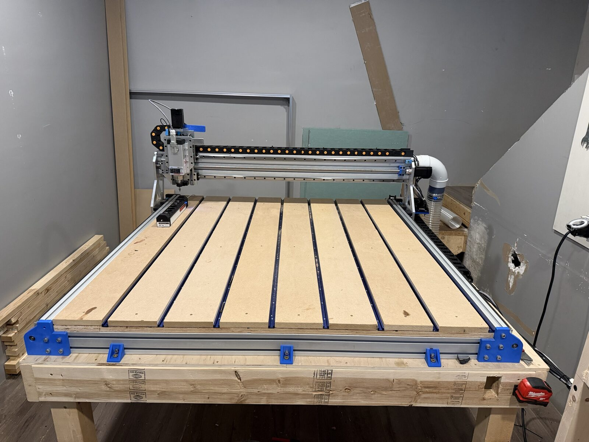

# CNC Mill — Doberman / FluidNC / RapidChange ATC

Working configuration and commissioning notes for a 3-axis CNC mill (X, Y1, Y2, Z)
running FluidNC on a Doberman board, with a YL620-A VFD spindle and a RapidChange
linear magazine automatic tool changer.

Everything here is the as-built state of a machine that homes, cuts and changes
tools. Values were measured on the machine, not copied from a template.



## Machine

| Item | Detail |
|---|---|
| Controller | Doberman CNC Board (Bart Dring), ESP32-S3, FluidNC |
| Motors | NEMA 24, 5.0 A, 3 N·m — StepperOnline 24E1K-30 |
| Drivers | CL57T v4.0 closed loop |
| Motor supply | Meanwell XDR-960E-48 — 48 V, 20 A |
| Logic supply | Lawlron NDR-120-12 — 12 V, 10 A |
| Rails | HGR20 throughout — X and Y 1500 mm, Z 300 mm with HGH20CA blocks |
| Ball screws | 1605, 5 mm pitch — X/Y RM1605 1500 mm, Z SFU1605 350 mm, BK12/BF12 supports |
| Axes | X, Y1, Y2 (auto-squaring gantry), Z |
| Endstops | ROURCK SN04-N inductive, NPN-NO, run at 5 V |
| Spindle | HLTNC GDZ80X73-2-2, 2.2 kW air cooled, 24000 rpm / 400 Hz |
| VFD | YL620-A |
| Tool changer | RapidChange linear magazine Premium, 6 pockets, ER20 |

Travel: X 1220 mm, Y 1200 mm, Z 115 mm. Z is tight — `tc.nc` reaches −105, so
there is 10 mm to spare.

At the bottom of Z travel the bare spindle nose sits 25 mm above the spoil
board, so with an ER20 nut and a tool fitted the tip reaches the board well
before the soft limit. **The Z soft limit does not protect the spoil board** —
tool length offsets and work zero do. `docs/tool-changer.md` has the full Z
geometry and the −90 clearance plane over the magazine.

## Layout

```
config/config.yaml              FluidNC machine config
macros/tc.nc                    M6 tool change
macros/measuretool.nc           macro0 — measure current tool
macros/findzposition.nc         macro1 — find IR beam Z position
docs/wiring.md                  pin assignments and the reasoning behind them
docs/vfd-yl620a.md              VFD parameters and speed calibration
docs/tool-changer.md            ATC coordinates, sequence, recovery
docs/troubleshooting.md         problems hit during commissioning and what fixed them
docs/deploying.md               getting files onto the controller
docs/images/                    photos of the machine and the wiring
tools/deploy.sh                 upload config and macros over the network
tools/deploy.ps1                the same, for Windows PowerShell
tools/deploy.cmd                double-clickable launcher for the above
tools/vfd_dump.py               read the VFD's parameters over Modbus (read only)
tools/vfd_set.py                write VFD parameters, verified by read-back
```

## Installation

Macros live in the controller's **internal flash**, not on an SD card. This matters —
`$SD/Run=` silently reports success and does nothing when the file isn't on a card.

Either through the FluidNC web UI, or over the network:

```
./tools/deploy.sh <board-ip> --restart
```

Then confirm:

1. `$LocalFS/List` — `tc.nc`, `measuretool.nc`, `findzposition.nc` present
2. `$CD` — the config loaded

See `docs/deploying.md`. There is no direct GitHub-to-board path; the upload has
to come from a machine on the same network.

## Daily startup

```
$H              home — Z first, then XY with Y/Y2 auto-squaring
M61 Q<n>        tell FluidNC what is in the spindle (Q0 if empty)
```

**After an E-stop, `$H` before anything else.** The E-stop cuts motor and
spindle power but leaves the controller running, so FluidNC does not know it
happened and the position on screen is stale. See `docs/wiring.md`.

`M61` is not optional. FluidNC sets `current_tool = -1` on every restart, and `tc.nc`
aborts with an alarm when it sees a negative tool number. `$H` does not fix this —
homing knows about position, not about what is in the spindle.

## Current state

Working:

- Homing on all axes, Y/Y2 auto-squaring
- Spindle across the full range, including tool-change speeds
- M6 tool change — load, unload, IR beam verification, tool setter touch-off
- Magazine verified at **all six pockets** over repeated changes
- Spindle motor overload left at 15.0 A — the 6 A nameplate value stops the
  spindle starting. See `docs/vfd-yl620a.md`; the heat discipline is the
  real protection.
- Y position holds — the left rail was out of parallel; loosened and re-torqued

Not wired yet:

- **CL57T ALM outputs** — the drivers have alarm outputs and nothing reads
  them, so a driver faulting on position error looks like lost steps. Plan for
  `fault_pin: gpio.37` is in `docs/wiring.md`.
- **E-stop signal to FluidNC** — the switch is hardwired and cuts power, but the
  controller never hears about it. Hence `$H` after every E-stop.

Not fitted:

- **Dust cover** — physically removed from the magazine. It is servo driven
  through an ATtiny and never responded to a 5 V logic signal, so it is out of
  the config and out of the macros. See `docs/tool-changer.md`.

## Credits

The machine is built from **[LienCNC-V2](https://github.com/eclsnowman/LienCNC-V2)**
by Eric Lien — his mechanical design, BOM and drawings. Full credit to him for
the machine; this repository covers only the control side of one build of it.

Nothing in this repository is copied from his. LienCNC-V2 ships a UCCNC `.pro`
configuration, while this machine runs FluidNC on a Doberman board, so the
config and macros here were written from scratch for different software.

At the time of writing that repository has no LICENSE file, and the Printables
listing does not name one either, so his CAD, drawings, BOM and controller
config are all-rights-reserved by default. Building a machine from a published
design is fine; redistributing his files is not. Link to the original rather
than copying anything in here.

Also standing on:

- [FluidNC](https://github.com/bdring/FluidNC) and the Doberman board — Bart Dring
- [RapidChange ATC](https://rapidchangeatc.com/) — the tool changer
- [RapidChangeATC_FluidNC_M6_Macro](https://github.com/rvalotta/RapidChangeATC_FluidNC_M6_Macro) — Ryan Valotta, the basis for `tc.nc`

`tc.nc`, `measuretool.nc` and `findzposition.nc` started as RapidChange's
generated macros and are modified for this machine: coordinates measured on the
hardware, the dust cover calls removed, probe seek raised to F600. That upstream
states no license either, so this repo carries none — adding one would imply
rights over the macro structure that are not mine to grant.
