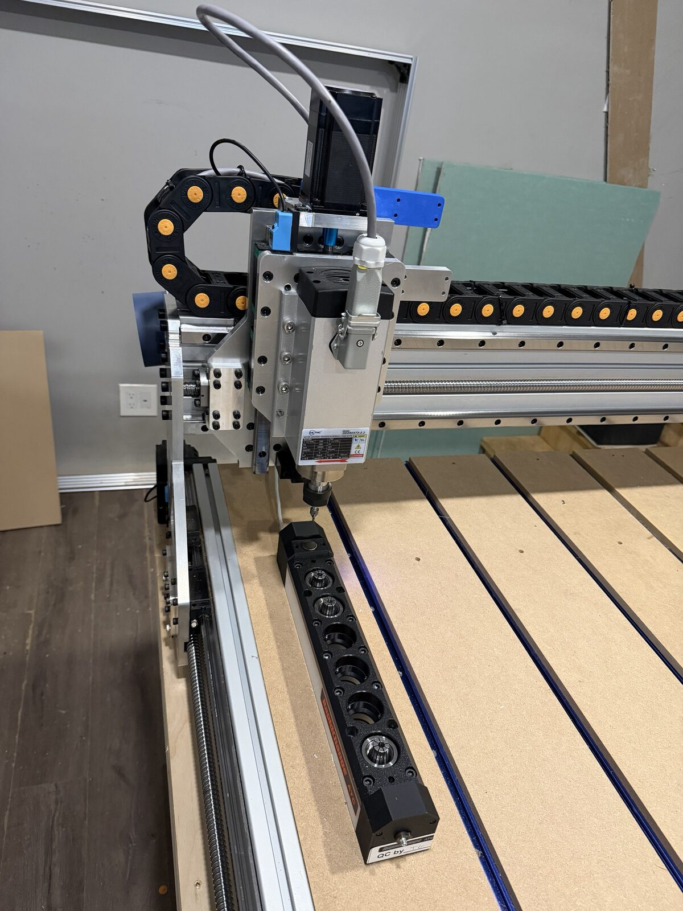

# RapidChange ATC

Premium linear magazine, 6 pockets, ER20. `macros/tc.nc` began as RapidChange's
generated macro (see
[rvalotta/RapidChangeATC_FluidNC_M6_Macro](https://github.com/rvalotta/RapidChangeATC_FluidNC_M6_Macro))
and is modified for this machine. Driven through FluidNC's `m6_macro` hook — not the greilick-industries firmware fork, which is a
separate approach that replaces the macro entirely and has no `m6_macro` support.

## Coordinates

All in G53 machine coordinates. Machine Z0 is at the top, at the home switch.

| Tool | X | Y |
|---|---|---|
| 1 | 1211.400 | 85.400 |
| 2 | 1211.400 | 130.400 |
| 3 | 1211.400 | 175.400 |
| 4 | 1211.400 | 220.400 |
| 5 | 1211.400 | 265.400 |
| 6 | 1211.400 | 310.400 |

Pitch 45.000 mm, base Y85.400. Tool setter sits at **X1211.000 Y32.000** — it is
separate hardware that happens to share an X value with the pockets, so pocket
corrections do not move it.

| Z | Purpose |
|---|---|
| 0 | Safe / traverse |
| −68 | Tool recognition zone 2 |
| −74 | Tool recognition zone 1 |
| −82 | Approach, just above the nut |
| −105 | Full engagement |

Six pockets in a line along Y, tool setter at the near end. The spindle nose is
at the top of its travel here, which is 90 mm clear of the magazine.

Six pockets in a line along Y with the tool setter at the near end. The spindle
is near the top of its travel here, about 90 mm clear of the magazine.

## Z geometry

Measured datums, both from the top of the spoil board:

- Bottom of the spindle, no collet, at Z−115: **25 mm**
- Top of the RapidChange magazine: **50 mm**

So spindle nose height above the spoil board = `25 + (115 + Z)`:

| Z | Nose height | vs magazine top | |
|---|---|---|---|
| 0 | 140 mm | +90 mm | safe / traverse |
| −68 | 72 mm | +22 mm | recognition zone 2 |
| −74 | 66 mm | +16 mm | recognition zone 1 |
| −82 | 58 mm | +8 mm | approach |
| **−90** | **50 mm** | **0 mm** | **clearance plane** |
| −105 | 35 mm | −15 mm | engagement |
| −115 | 25 mm | −25 mm | soft limit |
| −118 | 22 mm | −28 mm | rail end |

**Z−90 is the clearance plane over the magazine.** Above it the spindle passes
over the magazine freely; below it the nose is inside the magazine's envelope.

This verifies the macro geometrically: every XY move in `tc.nc` happens at Z0,
and the lowest the axis goes before an XY move is the −82 approach — both above
−90. The only travel below the clearance plane is the engagement plunge to
−105, which happens stationary over a pocket. Nothing traverses while the nose
is down inside the magazine.

Keep −90 in mind for any hand-written G-code that goes near X1211. Crossing that
plane anywhere other than directly over a pocket is what a crash looks like.

## Speeds and feeds

| Setting | Value |
|---|---|
| Load | M3 S1800 (~1,830 rpm) |
| Unload | M4 S2100 (~2,130 rpm) |
| Engagement feed | F2000 |
| Probe seek | F600 |
| Probe set | F50 |

**Z travel is 115 mm and the engagement depth is 105 mm.** Ten millimetres of
clearance, which is the tightest margin on the machine. Consequences worth
keeping in mind: there is no room to deepen the pockets, a magazine remount that
sits any lower will not reach, and the soft limit at −115 is the only thing
protecting the bottom of Z since there is no lower limit switch.

**Z `max_rate_mm_per_min` must stay above 2000.** It was at 1500, which silently
clamped every engagement move to 75 % of the designed feed. It is now 2500.

The engagement feed is deliberately slower than synchronous. The ER20 nut is
M25×1.5, so at 1,830 rpm a synchronous feed would be ~2,745 mm/min. F2000 is about
73 % of that, and the shortfall is what makes the spindle thread pull itself into
the nut and seat it.

## Sequence

Load:

1. Rapid to the pocket, Z−82
2. `M3 S1800`, dwell 1 s
3. Four plunges between Z−105 and Z−93 at F2000 — threads the nut
4. `M5`, retract Z−74, read beam — must be **blocked**
5. Z−68, read beam again — must be **blocked**
6. `M61 Q<n>`, then probe the tool setter and `G43.1`

Unload:

1. Rapid to the pocket, Z−82
2. `M4 S2100`, dwell 1 s
3. Plunge Z−105, retract Z−93 — unthreads
4. Z−74, read beam — must be **clear**

## Failure recovery

The macro uses `$Alarm/Send=3` as its abort signal. Alarm 3 is named "Reset while
in motion", which is misleading — nothing reset and no position was lost.

| Message | Meaning | Fix |
|---|---|---|
| Current tool not initialized | `current_tool` is −1 after a restart | `$X`, `M61 Q<n>`, retry |
| IR beam obstructed | Something in the beam at the start | Clear the magazine |
| Failed unload at zone 1 | Tool still on the spindle after unloading | Remove by hand, cycle start |
| Failed load at zone 1 | No tool detected after loading | Thread by hand, cycle start |
| Failed load at zone 2 | Tool detected at −74 but not −68 | Check the nut is fully seated |

Failures pause with `M0`. Fix the condition by hand, then **cycle start** — the
real-time character `~`, or the play button in the web UI.

`~` sent as a *line* from a different interface than the one running the job gets
rejected with "Another interface is busy". FluidNC gates lines needing the
protocol context by channel while a job runs. Send it as a raw character from the
interface that started the job, or use the web UI button.

## Dust cover — not connected

The Premium cover is two servos driven by a programmed ATtiny, with the blue wire
as its logic input. It is an **output** from the controller, not a sensor.

It never worked. What was established:

- gpio.46 (third 5 V output) delivers a clean 5.08 V on pin 2 under `M64 P1`
- The blue wire was confirmed on pin 2
- Unplugging the connector **opens** the cover, so the module idles its input high
- Driving 5.08 V into it does nothing
- The blue wire reads 2.55 V open-circuit — about half rail, a floating input, so
  there is no pull-up to a higher supply

The signal spec is not published. `user_outputs` is removed from the config and
the `M64 P1` / `M65 P1` lines are stripped from `tc.nc` and `measuretool.nc`,
because `M64` on an undefined output errors and aborts the macro.

**The cover has been physically removed from the magazine**, so there is nothing
for a tool to hit. If one is ever refitted, it must be driven or secured open
before running a tool change — `tc.nc` drives Z to −105 in the magazine.
