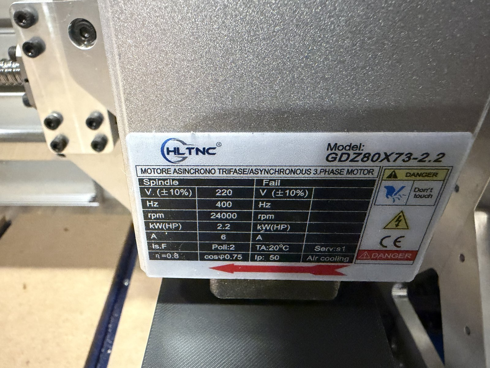

# YL620-A VFD — parameters and calibration

Spindle: HLTNC GDZ80X73-2.2, 2.2 kW, **air cooled**, 24000 rpm at 400 Hz.
So 60 rpm per Hz, and the VFD display is in 0.1 Hz units (483 means 48.3 Hz).



| Nameplate | |
|---|---|
| Voltage | 220 V ±10%, 3 phase |
| Frequency | 400 Hz |
| Speed | 24000 rpm |
| Power | 2.2 kW |
| **Current** | **6 A** |
| Poles | 2 |
| Efficiency | 0.8, cos φ 0.75 |
| Duty / cooling | S1 continuous, air, IP50, TA 20 °C |

Two poles at 400 Hz is what gives 24000 rpm, and it matches P12.02 on the
drive. Note the nameplate does not balance arithmetically — 6 A at 220 V with
cos φ 0.75 and η 0.8 is about 1.4 kW out, not 2.2 kW. That is normal for these
spindles. **Protect to the 6 A, not to the 2.2 kW**, because 6 A is the figure
that describes what the windings tolerate.

## Control

| Parameter | Value | Meaning |
|---|---|---|
| P00.01 | 1 | External terminal control |
| P00.04 | 400.0 | Max output frequency |

## V/F curve — the low-speed fix

Out of the box the spindle would not turn below about S4000. It needs voltage
boost at low frequency to make any torque down there. These came from the
YL620-A setup table's 400 Hz column and they are what made tool-change speeds
possible:

| Parameter | Value | Meaning |
|---|---|---|
| P00.05 | 400 | Max voltage output frequency |
| P00.06 | 100 % | Max output voltage |
| P00.07 | 3.5 Hz | Middle frequency |
| P00.08 | 20 % | Middle voltage |
| P00.09 | 0.2 Hz | Min frequency |
| P00.10 | 10 % | Min voltage |

20 % voltage at 3.5 Hz against the ~0.9 % a straight line would give is the whole
trick.

**Heat warning.** That much boost pushes real current through the windings at low
rpm, and the cooling fan is on the rotor, so there is almost no airflow down there.
Two or three seconds of nut threading during a tool change is fine. Do not leave
the spindle running slowly for minutes, and do not cut at these speeds.

## Analog input scaling

| Parameter | Value | Meaning |
|---|---|---|
| P03.10 | 3 | AI1 A/D lower limit |
| P03.11 | 1010 | AI1 A/D upper limit |
| P03.12 | **0** | Frequency at lower limit (raw 0) |
| P03.13 | 400.0 Hz | Frequency at upper limit (raw 4000) |

**P03.12 must be 0.** The setup table's 400 Hz column sets it to 60, which puts a
60 Hz floor under every commanded speed — those spindles are not normally run
slowly. With a floor, S1800 came out around 48 Hz instead of 30. Zeroing it makes
the curve run 0 → 400 Hz across the full analog range.

## Calibrated result

Measured after P03.12 was zeroed:

| Commanded | VFD display | Actual | Error |
|---|---|---|---|
| S1800 | 305 | ~1,830 rpm | +1.7 % |
| S2100 | 355 | ~2,130 rpm | +1.4 % |
| S24000 | 3920 | ~23,520 rpm | −2.0 % |

Close enough to stop. The residual ~1.2 Hz offset at the bottom and the ~2 %
shortfall at the top are AI1 ADC tolerance. Nut threading depends on the ratio
between spindle rpm and Z feed, and 1.7 % does not move that.

## Other

| Parameter | Value | Note |
|---|---|---|
| P04.09 | 1.0 s | Stall detection time. Raise to 3 if the VFD faults while threading a nut |
| P06.01 | 5.0 s | Accel time, 0 to max. 0 to 30 Hz is only ~0.4 s, so the macro's `G4 P1` dwell is ample |
| P06.02 | 5.0 s | Decel time |
| P12.19 | 8.0 kHz | PWM frequency |

These four were corrected from the dump. The table previously said 9 s / 8.6 s
accel and decel and 13 kHz PWM, which were the setup table's suggested values
copied in rather than read off the drive. The drive is on the plain defaults.
Nothing was wrong on the machine — only in this file.

## FluidNC side

```yaml
speed_map: 0=0.000% 24000=100.000%
```

Linear. All the shaping happens in the VFD.

## Fault codes

From the YL-620 manual. Worth knowing that manual names parameters `P9-01`,
`PA-26`, `PD` group — a different convention from this drive's `Pgg.ii`, so it
covers the wider family rather than this exact unit. The codes have matched so
far.

| Code | Meaning |
|---|---|
| Err01 | Inverter unit protection — output short, module overheat |
| Err02 | Overcurrent during acceleration |
| Err03 | Overcurrent during deceleration |
| Err04 | Overcurrent at constant speed |
| Err05 / 06 / 07 | Overvoltage during accel / decel / constant speed |
| Err08 | Control power fault |
| Err09 | Undervoltage |
| Err10 | **Inverter** overload |
| Err11 | **Motor** overload — first listed cause is a wrong overload parameter |
| Err12 | Input phase loss |
| Err13 | Output phase loss — check the leads to the spindle |
| Err14 | Module overheating |
| Err15 | External fault on a multi-function input |
| Err16 | Communication failure |
| Err18 | Current detection fault |
| Err19 | Motor tuning fault |
| Err21 | EEPROM read/write failure |
| Err23 | Motor short to ground |
| Err30 | Offload — running current below the set floor |
| Err40 | Fast current limit; load too large or motor blocked |
| Err45 | Motor over temperature |
| Err51 | Initial position error — *check rated current is not set too low* |

Err10 and Err11 are different things and the distinction matters: Err10 is the
drive protecting itself, Err11 is the drive protecting the motor using P12.00
and P01.05. Err51's note is the same trap from another direction.

## Reading the parameters back off the drive

`tools/vfd_dump.py` reads every parameter over Modbus RTU and writes them to a
markdown table. **Read only** — it issues nothing but function code 03, so it
cannot alter the drive.

```
pip install pyserial
python tools/vfd_dump.py --port COM5 -o docs/vfd-parameters.md
```

Adapter used here: **DSD TECH SH-U11F** — isolated, FTDI chip, screw terminals.
Isolation matters in this cabinet: a non-isolated adapter would tie the laptop's
USB ground to the VFD's ground reference, next to a 2.2 kW drive switching at
13 kHz.

Two wires to the VFD's RS485 terminals, A to A and B to B. No termination
resistor — the run is about a metre to a single device. If every read times out,
swap A and B; that is the usual first mistake and it does no harm.

About 12 seconds for the full sweep of 192 addresses; unimplemented ones return
a Modbus exception and are skipped.

### If the port will not open

```
python tools/vfd_dump.py --list
```

Lists the ports the machine can actually see, with USB vendor IDs. The SH-U11F
is FTDI, so it appears as **VID 0403**. On this laptop it is **COM3**:

```
COM6       no USB id    Standard Serial over Bluetooth link (COM6)
COM5       no USB id    Standard Serial over Bluetooth link (COM5)
COM3     0403:6001  USB Serial Port (COM3)
```

A port with no USB id is on-board, Bluetooth, or a leftover registry entry —
never the adapter.

`OSError(22, 'The semaphore timeout period has expired.', None, 121)` on open is
a **host and adapter problem, not a VFD problem**. It fails before a single byte
is sent, so wiring, baud rate, slave address and A/B polarity are all still
untested at that point — do not go rewiring the drive end over it.

Usual causes, in the order worth checking:

1. **The port is a Bluetooth link.** This is what happened here: COM5 and COM6
   are both "Standard Serial over Bluetooth link". Windows tries to raise an
   RFCOMM connection to a device that is not there, waits, and times out — and
   error 121 is exactly how that surfaces. These ports exist whether or not
   anything is paired.
2. **The adapter is on a different COM number.** `--list` settles it.
3. **A ghost port.** Run `--list` with the adapter plugged in, then unplug it
   and run it again. A port that stays in the list when unplugged is a leftover
   from a previous adapter and will never open.
4. **USB link failure.** Try a different port directly on the PC rather than
   through a hub, and a different cable. Error 121 is a USB timeout at heart.
5. **Driver.** A device showing in Device Manager with a warning triangle, or
   enumerating under an unexpected VID, has a driver problem rather than a
   wiring one.

Comms settings on this drive, which are the script's defaults:

| Parameter | Value | Meaning |
|---|---|---|
| P03.00 | 4 | 19200 bps |
| P03.01 | 10 | Slave address |
| P03.02 | 2 | 8 data bits, 1 stop, no parity |

### Writing parameters back

`tools/vfd_set.py` writes parameters. It is a **separate script from
`vfd_dump.py` on purpose** — the dump tool issues nothing but function code 03
and therefore cannot alter the drive, and that property is worth keeping
provable rather than merging away.

```
python tools/vfd_set.py --port COM3 --set P12.00=80
python tools/vfd_set.py --port COM3 --restore docs/vfd-parameters.md --dry-run
```

Every write is function 06 for a single register, followed by a function 03
read of that same register to confirm the value took. Nothing is written blind,
and a mismatch exits non-zero. This matters more than it sounds: a drive that
refuses a write — because it is running, or locked — may still echo the request
as though it succeeded. Only the read-back catches that.

#### The dump is not a config file

Pushing `vfd-parameters.md` back wholesale would be a mistake, which is why
`--restore` diffs rather than replays. The file mixes three kinds of thing:

- **Settings**, which are writable.
- **P11.xx live readings** — output current, frequency, heatsink temperature.
  Restoring these means writing a snapshot of a temperature into a read-only
  register.
- **P13.xx identity** — software and hardware version, manufacture date.

And one live wire: **P00.13 is the parameter lock, where value 10 means
restore factory defaults.** It sits in the middle of that file and it is
writable. A bulk push-back that ever carried a 10 there — a typo, a bad merge,
one corrupted frame — would wipe the drive, V/F curve included.

So the script refuses, by register, regardless of what a saved file says:

| Refused | Why |
|---|---|
| P00.13 | parameter lock; 10 restores factory defaults |
| P11.xx | live readings, not settings |
| P13.xx | drive identity, read only |
| P10.01, P10.03 | live counter and timer values |

#### What it does not do

**It cannot tell whether the spindle is running.** The registers that look like
they should say are ambiguous on this drive, so there is no guard — only a
prompt. A guard that might not work is worse than none, because it invites
trust it has not earned. Stop the spindle yourself before writing.

For a one-off change the front panel is still the better tool: thirty seconds,
and a wrong keypress affects one value. The script earns its place for
repeatable changes and for rebuilding a drive that has been replaced or reset.

### The register mapping

**Pgg.ii is at register `gg * 256 + ii`**, so P03.12 is 0x030C and P12.19 is
0x0C13.

That is not from the YL620 manual, which does not document it. It comes from
FluidNC's own YL620 driver, which reads `03 03 08 00 02` — two registers from
0x0308 — and decodes them as the minimum and maximum RPM. 0x0308 and 0x0309 are
P03.08 and P03.09, the panel potentiometer frequency limits. That pins the
scheme down.

The same driver also exposes the control registers:

| Register | Purpose |
|---|---|
| 0x2000 | Run / direction / stop |
| 0x2001 | Frequency setpoint |
| 0x200B | Output frequency readback |

**Recorded for reference only. Do not move spindle control to Modbus.** Bart
Dring recommends 0-10 V over RS485 for the Doberman, and the reliability
argument is decisive: an analog voltage has no protocol to fail, while a Modbus
link adds a failure mode that does not otherwise exist. If comms drop mid-cut
the drive does whatever P03.03 dictates — decelerate, coast, DC brake or keep
running — and none of those is acceptable with a tool in the work. A cabinet
containing a drive switching at 13 kHz is also the worst place to put a serial
link that spindle control depends on.

RS485 here is for **reading** parameters, where a dropped frame costs nothing
because no motion depends on the transfer completing.

### What the dump confirmed

`docs/vfd-parameters.md` is the as-built state, read 2026-10-10. Cross-checked
against the setup table PDF, it settles several things:

- **P00.04 = 4000.** The one parameter whose value was known independently, so
  this validates both the `Pgg.ii -> gg*256 + ii` mapping and the 0.1 Hz
  scaling across the whole register space, not just the handful set by hand.
- **P03.12 = 0.** The low-speed fix is confirmed on the drive, not just
  remembered. The setup table's 400 Hz column puts 60 here, which is exactly
  the floor that held S1800 at 48 Hz.
- **P07.08 = 3** — frequency source is Analog Input 1, governed by
  P03.10-P03.13. This is what makes the 0-10 V input the speed command at all,
  and it was never explicitly verified before.
- **P12.02 = 2** motor poles, which is what makes 400 Hz equal 24000 rpm.
- Percentages are 0.1 % units: P00.06 reads 1000 for 100.0 %, P00.08 reads 200
  for 20.0 %.

### P12.00 — do not set this to 6.0 A. It stops the spindle starting.

| Parameter | Value | Result |
|---|---|---|
| P12.00 | 150 = 15.0 A | as shipped; spindle starts; no real thermal protection |
| P12.00 | 60 = 6.0 A | matches the nameplate, **and the spindle will not start** |

Tried on 2026-10-10 and reverted. The panel did read 6.0, which at least
**settles the 0.1 A scaling** for this parameter — it had been inferred from
P12.05 rather than documented.

**The drive said `Err11` — motor overload.** Not an overcurrent trip; the
overload *model*. P12.00 is the current that model measures against, and
P01.05 is the threshold as a percentage of it:

| | Against 15.0 A | Against 6.0 A |
|---|---|---|
| P01.05 overload protection, 130 % | 19.5 A | **7.8 A** |
| P01.06 overload protection time | 120 s | 120 s |

A 2.2 kW induction spindle draws well past 7.8 A getting moving, so the
overload trips before it is turning. Changing P12.00 moves every limit derived
from it, which is what was missed when this was first recommended — it was
treated as one threshold rather than the scaling base for the group.

**A latched fault survives the revert.** After putting P12.00 back, clear the
fault (power-cycle the VFD) or the spindle stays dead and it looks as though
the revert did not work.

**The underlying problem is still real.** At 15.0 A the overload cannot
protect a 6 A spindle, and that matters most during low-speed nut threading,
where the V/F boost pushes current through windings the rotor fan is barely
cooling.

But the drive's overload model is too crude to both let a boosted low-speed
start happen and protect a 6 A motor, because one percentage governs both.
Raising P01.05 to allow the start raises the sustained trip point by the same
proportion, which gives most of the protection back.

The honest options, none yet attempted:

- **An intermediate P12.00.** Something like 90-100 (9-10 A) tightens the
  overload meaningfully from 15 A without starving the start. Crude, but it
  moves in the right direction and is one parameter.
- **Measure first.** A clamp meter on one spindle lead during a start and
  during nut threading gives the actual numbers, and then P12.00 and P01.05
  can be chosen rather than guessed. This is the one worth doing.

Until then the heat warning above stays advisory: do not leave the spindle
turning slowly for minutes.

Until then the heat warning above stays advisory: do not leave the spindle
turning slowly for minutes.

The nameplate says 6 A. P12.00 is what the drive's thermal overload protection
measures the motor against, and it is set at **two and a half times** what the
spindle can take — so that protection cannot act before the windings are in
trouble. P12.05, the *converter's* rated current, also reads 150, which is the
likely explanation: the motor figure was left at the drive's rating.

This matters most at the bottom of the range. The V/F boost puts 20 % voltage
in at 3.5 Hz, which drives real current through the windings while the
rotor-mounted fan is barely turning — the heat warning above. With P12.00 at
15 A the drive will watch that happen and do nothing.

**Superseded — see above. Do not run this.**

```
python tools/vfd_set.py --port COM3 --set P12.00=60
```

**Run a tool change after any change here.** The limit is now 2.5x
tighter than anything this drive has run with, and nut threading at 1830 rpm
with full V/F boost is the most current-hungry thing this spindle does. If the
VFD faults during threading, that is the cause — P04.09 (stall detection time,
currently 1.0 s) is the knob, per the note above.

`docs/vfd-parameters.md` still shows the old 150 and is now stale. Re-run the
dump to bring it back to as-built; it is a machine-written record and editing
the row by hand would defeat the point of having it.

### Left alone deliberately

**P12.01 reads 230 V against a 220 V nameplate.** Within the plate's ±10 %, and
on a V/F drive the rated motor voltage scales the whole output curve — changing
it would shift the low-speed boost that took the longest to get right, and the
S1800/S2100/S24000 calibration with it. Not worth disturbing a working curve
for a 4 % bookkeeping correction. If it is ever changed, re-run the calibration
table.

**P01.04 overcurrent trips at 200 %** against the setup table's typical 120 %.
Correcting P12.00 improves this on its own: 200 % of 6 A is 12 A, where before
it was 200 % of 15 A. A tighter instantaneous trip also risks nuisance faults
on acceleration, so one change at a time.

### Values come back raw

Frequencies are stored in 0.1 Hz, the same as the front panel: 4000 is 400.0 Hz,
300 is 30.0 Hz. That is why P03.12 reads 0 rather than 0.0 and why the display
showed 483 for 48.3 Hz during commissioning.

A dump is the as-built state, not a diff. The parameters that actually matter on
this machine are the ones documented above — the V/F curve and the analog
scaling. The rest are factory defaults, and the setup table PDF is the reference
for what those should be.
