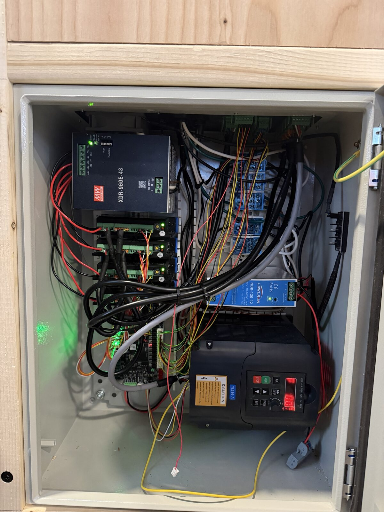
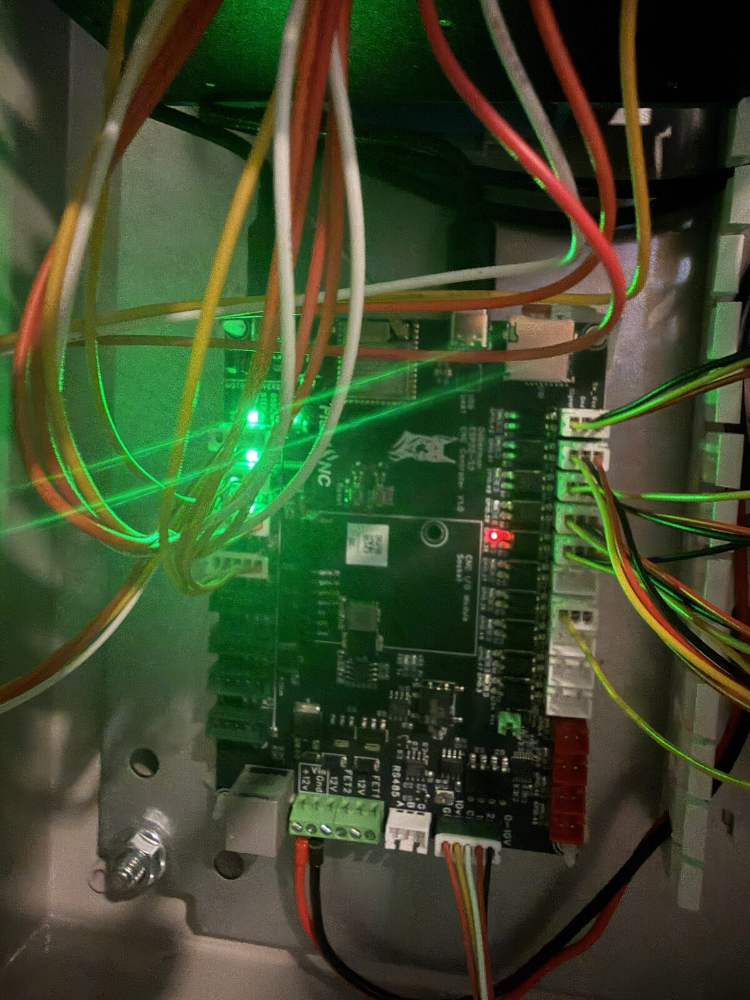
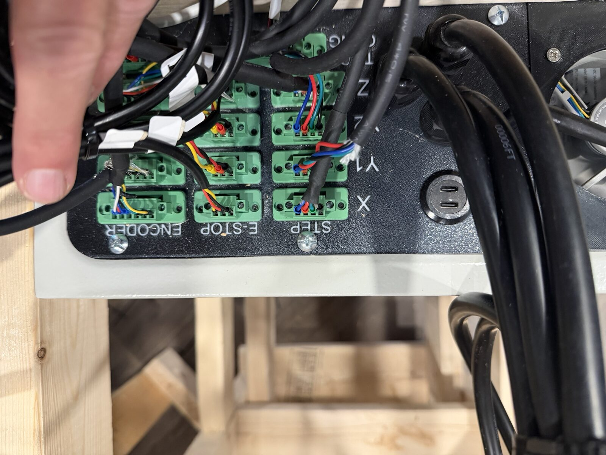
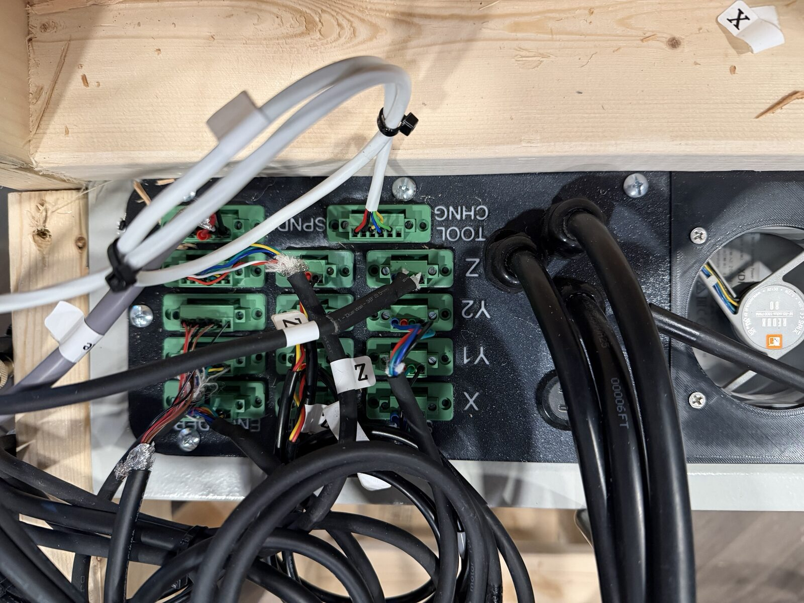
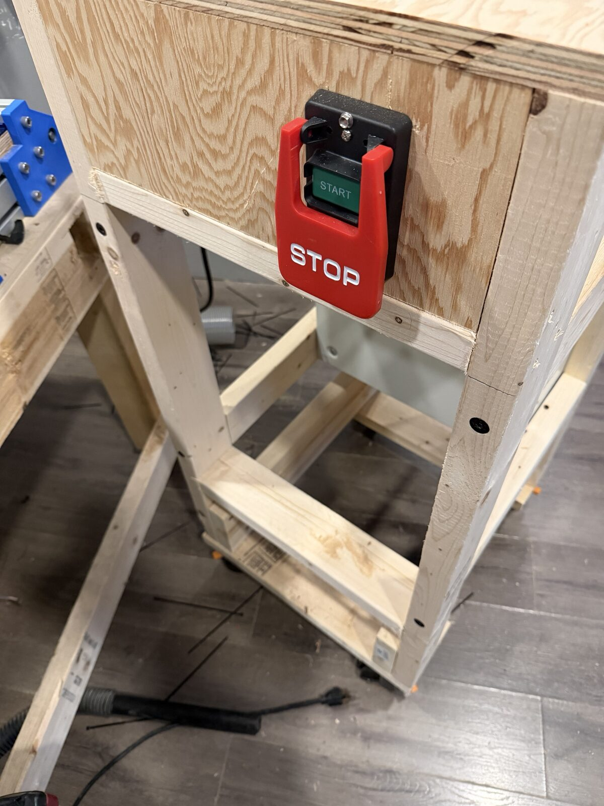

# Wiring and pin assignments

## Doberman input pins — the thing to know first

GPIO 36–42 are **opto-isolated inputs with onboard pull-ups**. Consequences:

- Never add `:pu` or `:pd` — the pull-up is already on the board
- NPN-NO sensors use `:low`
- These pins **cannot be used as outputs**. The GPIO sits behind a phototransistor
  and can only read. Configuring one as an output throws no error and does nothing.
- A `Switch Vcc` jumper selects 5 V or Vin (12 V) for *all* inputs together
- The PCB LED lights when an input is pulled low

This board is set to **5 V**, because the tool changer's sensors need 5 V.

## Endstops

ROURCK SN04-N inductive, NPN-NO, running at **5 V**.
Brown to +5 V, blue to 0 V, black to the input pin.

The `Switch Vcc` jumper is global, and the tool changer's sensors need 5 V, so
the endstops run at 5 V too — there is no way to have one at 5 V and the other
at 12 V from the board.

These SN04-N are specified 5–30 V DC, so 5 V is in spec but at the very bottom
of the range. They work reliably. If endstops ever start behaving erratically,
supply voltage is worth ruling out early rather than late.

| Axis | Pin | Config |
|---|---|---|
| X | gpio.42 | `limit_neg_pin: gpio.42:low` |
| Y1 | gpio.41 | `limit_neg_pin: gpio.41:low` |
| Y2 | gpio.40 | `limit_neg_pin: gpio.40:low` |
| Z | gpio.39 | `limit_pos_pin: gpio.39:low` — Z homes up |

X and Y home negative, Z homes positive. All three home to `mpos_mm: 0`, so after
`$H` the machine reads 0, 0, 0 and machine zero sits at the switches.

## Spindle — 0-10 V module

| Signal | Pin |
|---|---|
| Analog out | gpio.6 |
| Forward | gpio.7 |
| Reverse | gpio.8 |

The Doberman 0-10 V module labels its terminals **VI** (signal), **Grn** (analog
common), **Out1** (= FWD), **Out2** (= REV) and **Com** (digital common) rather
than the generic names. The YL620-A has no terminal marked plain `COM` — digital
common is **XGND** and analog common is a separate **GND**.

The module's trim pot is set to 10.13 V measured under load, which gives 392 Hz at
a commanded S24000.

## Tool changer — 5-wire harness

| Wire | Function | Pin |
|---|---|---|
| Red | 5 V | input header Vcc |
| Black | Ground | input header GND |
| Green | Tool setter | gpio.36, `probe: pin: gpio.36:low` |
| Yellow | IR beam | gpio.38, `user_inputs: digital0_pin: gpio.38:low` |
| Blue | Dust cover | see below — not currently connected |

IR beam reads **1 when clear, 0 when blocked**, verified on the machine.
The macros read it with `M66 P0 L0` into `#5399`.

## The hardware



Cabinet, top left to bottom right: Meanwell XDR-960E-48 (48 V, 20 A) for the
motors, the CL57T closed-loop drivers below it, Lawlron NDR-120-12 (12 V, 10 A)
for logic, and the YL620-A VFD across the bottom. The Doberman sits to the left
of the VFD.





Machine-side connections land on a breakout panel rather than at the board
directly. STEP per axis (X, Y1, Y2, Z), E-STOP, and ENCODER for the CL57T
closed-loop feedback.



The other half carries SPNDL and TOOL CHNG — the 5-wire magazine harness lands
on that one.

## Emergency stop



Hardwired paddle switch on the front of the table. It **cuts power to the
moving parts — motors and spindle — and deliberately leaves the Doberman
powered.**

Keeping the controller alive is the right call. The WebUI stays up, the config
stays loaded, and `current_tool` is not reset to −1, so you are not re-doing
`M61` on top of everything else.

**But it means FluidNC does not know the E-stop happened.** The controller keeps
its own idea of position while the motors are dead, so after an E-stop the
displayed MPos is stale and looks perfectly normal. Nothing alarms and nothing
forces a re-home.

**Always `$H` after an E-stop**, before any move. Treat the position on screen
as fiction until you have.

### Worth wiring: tell the controller

FluidNC has two control inputs for exactly this, both of which do an immediate
hard stop plus a critical alarm that only a soft reset clears, and which block
homing and unlock until then:

```yaml
control:
  fault_pin: gpio.37:low   # all four CL57T ALM outputs, ganged
  estop_pin: gpio.XX       # a spare contact on the E-stop switch
```

**gpio.37 is the pin to use.** It is a free opto input — it carried the dust
cover wire before that was abandoned — and it sits in the same header block as
the limit switches, so the wiring lands next to everything else.

### Ganging four ALM outputs

Each driver brings out a **single ALM pin**, not an ALM+ / ALM- pair. So the
alarm is a single-ended output returning through the driver's signal common —
the same common the step and direction pairs already share with the Doberman.
There is no floating contact to work with.

**That rules out a series chain.** Four single-ended outputs referenced to one
common can only be paralleled:

- all four ALM pins to gpio.37's signal pin
- driver signal common tied to the input header GND (it already is, through the
  step/dir return)

Parallel wired-OR is the right behaviour — any one driver asserting pulls the
input — but it has a cost worth stating plainly.

**It fails silent.** A broken ALM wire or a connector knocked off removes that
driver's protection with no indication at all; the input sits healthy and
nothing ever fires. With a floating contact a series chain would have caught
that, because an open loop is itself an alarm. Single-ended, there is no
fail-safe arrangement available. The protection is therefore only as good as
the last time it was tested — so test it deliberately, and re-test after any
work in the cabinet.

#### Polarity must be measured, not assumed

Published descriptions of this output disagree with each other, so measure.
With the drivers powered and idle, meter resistance from one ALM pin to the
driver's signal common:

| Idle reading | Output | Config |
|---|---|---|
| Open / high | Open-collector, pulls low on alarm | `fault_pin: gpio.37:low` |
| Near short | Conducting when healthy, releases on alarm | see below |

Then force an alarm on that one driver — unplug its encoder and command a short
move — and re-measure. Two readings on one driver settle it for all four.

**If it turns out to be active high** — sourcing on alarm rather than sinking —
it cannot drive gpio.37 directly. The opto input has an onboard pull-up and
expects to be pulled *down*; a sourcing output just fights the pull-up and
nothing happens. That case needs one inverting stage: each ALM through a signal
diode (1N4148) into a shared base resistor, a small NPN with its emitter to
GND and its collector on gpio.37. The diodes keep the four outputs from
back-feeding each other.

### Testing it

Two stages, because they fail differently.

1. **The input and the config.** With `fault_pin` set and the board restarted,
   short gpio.37's signal pin to GND. FluidNC should drop straight into a
   critical alarm.
2. **A real driver fault.** Unplug one motor's encoder and command a short move
   — the driver sees position error it cannot correct and asserts ALM.

A critical alarm only clears with a soft reset (Ctrl-X), and that resets
`current_tool` to −1. So after testing: `$H`, then `M61 Q<n>`.

`estop_pin` is meant for a user-operated switch; `fault_pin` is meant, in the
firmware's own words, for "a stepper driver's fault/alarm output". The CL57T
drivers have those alarm outputs and nothing is currently reading them — so a
driver that faults on position error looks exactly like lost steps.

Neither replaces cutting power. FluidNC's own comment on `estop_pin` is blunt
about it: "this alone is only a control-input-level stop; a true e-stop should
also cut power directly." The hardwired switch is the real safety function.
Adding the signal just stops the software from lying about where the machine is.

## Doberman outputs, for reference

Four 5 V outputs on red 2-pin connectors, driven by a 74AHCT125 — true push-pull
5 V, 20 mA each and 50 mA total. Left to right:

| Position | Pin | Note |
|---|---|---|
| 1st | gpio.4 | also fires MOSFET1 |
| 2nd | gpio.5 | also fires MOSFET2 |
| 3rd | gpio.46 | ESP32-S3 strapping pin |
| 4th | gpio.45 | ESP32-S3 strapping pin |

On each connector, **pin 2 is signal and pin 1 is ground**.

Two MOSFETs, 3 A continuous / 5 A peak, with flyback diodes to VMot. They switch
to ground when their GPIO is active, and VMot is always 12 V. They share gpio.4
and gpio.5 with the first two 5 V outputs, so driving those outputs fires a MOSFET
as a side effect — avoid them for logic signals if anything is attached.
